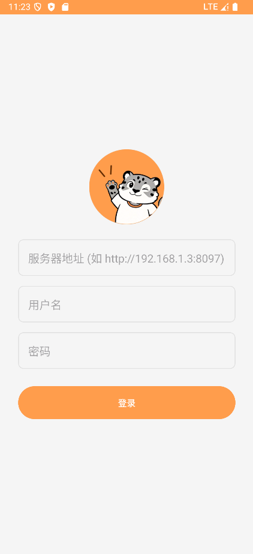
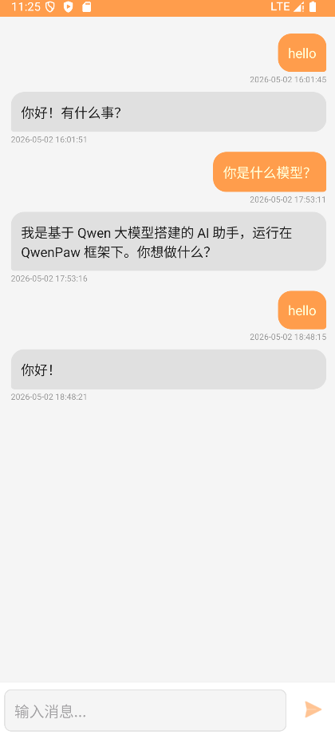

# QwenPaw Chat Android App

基于 QwenPaw RESTful API 的 Android 原生聊天应用，使用 Kotlin 开发，支持 SSE 流式响应。

## 接口文档

[api导航](https://qwenpaw.agentscope.io/docs/api-tutorial)

## capture

| 截图 | 描述 |
| --- | --- |
|  | 登录页面 |
|  | 聊天主页面 |

## 技术栈

- **语言**: Kotlin
- **最低 SDK**: 24 (Android 7.0)
- **目标 SDK**: 34 (Android 14)
- **UI 框架**: Android View System + ViewBinding
- **架构**: MVVM (Model-View-ViewModel)
- **数据库**: Room (Jetpack 组件)
- **网络**: HttpURLConnection + Kotlin Coroutines + Flow
- **构建工具**: Gradle 8.5 + AGP 8.5.0

## 项目架构

```
app/
├── src/main/
│   ├── java/com/qwenpaw/chat/
│   │   ├── data/              # 数据层
│   │   │   └── ChatRepository.kt
│   │   ├── db/               # 数据库层 (Room)
│   │   │   ├── AppDatabase.kt
│   │   │   ├── MessageDao.kt
│   │   │   └── MessageEntity.kt
│   │   ├── model/            # 数据模型
│   │   │   └── ChatModels.kt
│   │   ├── network/          # 网络层
│   │   │   ├── AuthService.kt
│   │   │   └── SSEClient.kt
│   │   ├── ui/               # UI 层
│   │   │   ├── ChatActivity.kt
│   │   │   ├── ChatAdapter.kt
│   │   │   └── LoginActivity.kt
│   │   └── util/             # 工具类
│   │       └── TokenManager.kt
│   └── res/
│       ├── layout/           # 布局文件
│       ├── drawable/         # 图标和形状
│       └── values/           # 资源值
```

## 功能特性

- ✅ 用户登录认证（令牌自动刷新）
- ✅ SSE 流式响应（实时显示 AI 回复）
- ✅ 消息本地持久化存储
- ✅ 多轮对话支持（通过 session_id 维持上下文）
- ✅ 消息时间戳显示
- ✅ 用户可配置服务器地址
- ✅ 错误处理和提示

## 使用说明

### 环境要求

- Android Studio Hedgehog 或更高版本
- JDK 17 或更高版本
- Android SDK 34

### 构建项目

1. 克隆项目后，用 Android Studio 打开 `paw-app` 目录
2. 等待 Gradle 同步完成
3. 点击 Run 按钮安装到设备

### 首次使用

1. 启动应用后，进入登录页面
2. 填写以下信息：
   - **服务器地址**: QwenPaw 服务地址（如 `http://192.168.1.3:8097`）
   - **用户名**: 你的账号
   - **密码**: 你的密码
3. 点击"登录"按钮
4. 登录成功后自动跳转到聊天页面

### 发送消息

1. 在底部输入框输入消息
2. 点击发送按钮或按回车
3. 等待 AI 回复（支持流式显示）

### 修改服务器

如需更换服务器地址，退出登录后重新登录即可。

## API 对接说明

应用对接 QwenPaw RESTful API，详细文档请参考 [QwenPaw RESTful API 文档](docs/qwenpaw-restfull-api.md)。

### 主要接口

| 接口 | 方法 | 说明 |
|------|------|------|
| `/api/auth/login` | POST | 用户登录 |
| `/api/console/chat` | POST | 发送聊天消息 (SSE) |

### 请求认证

- 本地请求：自动跳过认证
- 远程请求：需要 Authorization Bearer Token

## 注意事项

1. 应用使用 HTTP 明文传输，请仅在可信任的网络环境中使用
2. 首次登录后，令牌会本地存储，下次启动自动刷新
3. 聊天记录存储在设备本地数据库中
4. SSE 连接超时设置为 3 分钟，适合 AI 回复场景

## 许可证

MIT License

## 联系方式

如有问题或建议，请提交 Issue。
